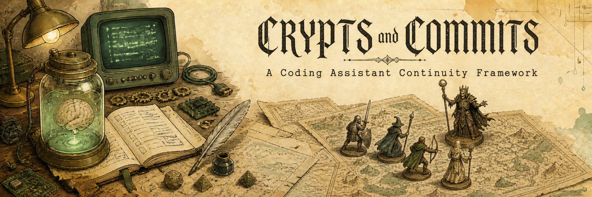

<p align="center">
  
</p>

# Crypts and Commits

Crypts and Commits ("CAC") is a Coding Assistant Continuity Framework. It uses
a tabletop-gaming metaphor to describe collaboration between a developer and
an AI coding assistant: the developer plays Game Master, establishing
context, making decisions, and retaining final authority over the session;
the assistant plays through that context to get work done. The `cac` CLI and
its `cac-mcp` MCP server are how an assistant records project context and
tracks its own work across sessions, so continuity survives context resets
and session boundaries instead of being rebuilt from scratch every time.

This repository is the development workspace for the project — and, per the
[Repository layout](#repository-layout) below, its own live proving ground.

## Why Crypts and Commits

Two problems drove this project.

The first is context loss between sessions — not for a single developer, but
for a team. Individual coding harnesses have started addressing memory within
one developer's own sessions (compaction, recall, that kind of thing), but
none of that holds once more than one person, and often more than one tool,
is involved. Each developer ends up building their own private convention for
how they work with their assistant, and those conventions drift apart from
each other's — the same failure mode as any team with weak communication,
just sharper, because now the team member losing the thread every session is
the AI itself. The common workaround — stuffing more and more into a single
session's context window — doesn't fix that. It just defers the same reset to
a later, larger session, with a bigger blast radius when it finally happens.

The second is that betting a team's entire workflow on one coding assistant is
a real, present risk, not a hypothetical one. Anyone building with these tools
over the past year has likely already lived through an outage, a usage cap, or
a sudden change in pricing or capability from a vendor they depend on. A
framework that only works with a single assistant doesn't remove that bus
factor — it just relocates it.

Crypts and Commits addresses both by moving context and work history out of
any one session, and any one assistant, and into the repository itself.
`.sourcebook/` is a small, versioned domain model — World, Lore, Regions,
Campaigns, and Encounters — that lives alongside your code, is committed the
same way your code is, and is driven through a shared `cac` CLI and MCP server
that any compliant coding assistant can use. An Encounter isn't a chat
transcript; it's a structured, reviewed unit of work — Requirements, Rationale,
Plan, and Verification — that survives the session that produced it and can be
picked up by a different developer, on a different assistant, without either of
them starting from zero.

The result is meant to feel less like a framework you have to remember to use
and more like a shared memory your team and its assistants already have. You —
the Game Master — still make every real decision: what gets built, when a plan
is reviewed, when it's approved to run, when it's actually done. The assistant
does the work. `.sourcebook/` is what makes sure neither of you has to keep
re-explaining yourselves to the other, or to whoever picks this up next.

## Documentation

- **[Quickstart](docs/QUICKSTART.md)** — adopting CAC in your own project:
  install the package, bootstrap `.sourcebook/`, and hand off to your agent.
- **[Workflow Reference Guide](packages/crypts-and-commits/src/cac/core/templates/docs/workflow.md)**
  — the single source of truth for the `.sourcebook` domain model: every
  object's structure, its status lifecycle, and how the types connect. Also
  retrievable on demand by an agent via `docs_get("workflow")` (MCP) or
  `cac docs get workflow` (CLI), once a project is bootstrapped.
- **[Sourcebook Migration Guide](packages/crypts-and-commits/src/cac/core/templates/docs/migration-guide.md)**
  — carrying an existing `.sourcebook` forward across schema versions.
  Retrievable the same way, via `docs_get("migration-guide")` /
  `cac docs get migration-guide`.
- **[Changelog](docs/CHANGELOG.md)** — notable changes, by release.

## Domain model & personas

Borrowing a tabletop metaphor here isn't decoration — a ruleset like this
gives collaboration structure a vocabulary that's already precise and
already shared. "Game Master" unambiguously means final authority rests with
a human, not the assistant. An "Encounter" is a bounded unit of work with a
beginning and an end, not an open-ended chat. A "Campaign" is understood to
outlive any single session. Coding assistants are trained on a large body of
text that already uses these words this way, so the metaphor doubles as a
low-ambiguity interface between a developer's intent and a model's behavior
— fewer bespoke conventions to define and re-explain per project, and less
room for a session to quietly redefine its own scope or authority as it goes.

`.sourcebook/` content is organized around five object types, plus the two
people/agents that drive them:

- **World** — a project-level summary, read first to prime context.
- **Lore** — a standard, convention, or best practice used to review an
  encounter's plan before work starts. Lore assigned to the world is global;
  lore assigned to a region only applies within that region.
- **Region** — a documented path within the repository (e.g. frontend vs.
  backend) that carries its own conventions and lore.
- **Campaign** — a long-running initiative, analogous to a Jira Epic,
  expected to span many encounters before it's done.
- **Encounter** — a concrete unit of work within a campaign: either a plan
  the agent is expected to execute (`scripted`, with Requirements,
  Rationale, Plan, and Verification sections) or a record of manual work
  already done outside that flow (`unscripted`, Requirements and Rationale
  only). Both kinds move through a code-enforced `draft` → `reviewed` →
  `open` → `completed` lifecycle (or `abandoned` at any point before that).
- **AI Assistant** — the coding assistant driving `.sourcebook/` through the
  `crypts-and-commits` MCP server (or the `cac` CLI as a fallback): reading
  world/lore/region context before acting, and drafting, executing, and
  recording encounters as work happens.
- **User (Game Master)** — the developer. Establishes context, makes the
  judgment calls the assistant can't make for itself, and holds final
  authority: approving an encounter's move into review, its move into
  `open`, and its move into `completed`.

See the [Workflow Reference Guide](packages/crypts-and-commits/src/cac/core/templates/docs/workflow.md)
for the full structural and procedural detail behind all of the above.

## Repository layout

This is a [PDM workspace](https://pdm-project.org/en/latest/usage/monorepo/)
(`[tool.pdm.workspace]` in the root `pyproject.toml`) containing independent
packages:

- **[`packages/crypts-and-commits`](packages/crypts-and-commits)** — the core
  framework: the `cac` Python package, its `cac` console script, and the
  `crypts-and-commits` MCP server. This is the project's actual deliverable.
  ([package README](packages/crypts-and-commits/README.md))
- **[`packages/demo-api`](packages/demo-api)** — a demonstration FastAPI
  backend used for development testing within the project (not a
  distributable library). ([package README](packages/demo-api/README.md))
- **[`packages/demo-ui`](packages/demo-ui)** — a demonstration React/Vite
  frontend exercising `demo-api`.
  ([package README](packages/demo-ui/README.md))

The `demo-api`/`demo-ui` pair forms a standalone, read-only Q&A application:
a browser hitting a running server, independent of any coding-assistant
harness, that answers questions with retrieval grounded in this repository's
own indexed sourcebook content and packaged docs — not by re-parsing
markdown directly. It exists to demonstrate `cac` operating alongside
non-`cac` application code in the same repository.

Beyond hosting that demo, this repository dogfoods the framework on itself:
its own `.sourcebook` — a populated world summary, lore, regions, and
campaign/encounter history — is live and is the actual source of truth for
this project's context and in-flight work, driven through the same `cac`
CLI/MCP surface described above rather than treated as a placeholder. See
[Exploring this repository's sourcebook](#exploring-this-repositorys-sourcebook)
below to look at it yourself.

## Running the demo apps

`demo-api` and `demo-ui` are two independent servers, run in separate
terminals.

### demo-api

From the repository root:

```bash
pdm install
```

`demo-api` calls an LLM through [OpenRouter](https://openrouter.ai/keys), so
it needs an API key:

```bash
cp packages/demo-api/.env.example packages/demo-api/.env
# then edit packages/demo-api/.env and set OPENROUTER_API_KEY
```

Then start the server:

```bash
pdm run uvicorn demo_api.main:app --app-dir packages/demo-api/src --reload
```

Serves on http://localhost:8000 — Swagger UI at `/docs`, health check at
`/health`.

### demo-ui

```bash
cd packages/demo-ui
npm install
npm run dev
```

Serves on http://localhost:5173. In dev mode, requests to `/health` and
`/chat` are proxied to `demo-api` on port 8000 (see
`packages/demo-ui/vite.config.ts`), so start `demo-api` first to see the
header's status indicator go online and the chat UI respond.

## Exploring this repository's sourcebook

Since this repository drives its own `.sourcebook` through `cac`, its world
summary, lore, regions, and campaign/encounter history are all inspectable
the same way an agent session would read them. From the repository root
(`cac` is an editable install inside this workspace's `.venv`, not a global
install, so it's only on `PATH` here via `pdm run`):

```bash
pdm install
pdm run cac world get              # project-level summary
pdm run cac lore list              # standards and conventions in force
pdm run cac region list            # documented paths within the repo
pdm run cac campaign list          # every campaign and its status
pdm run cac encounter list         # encounters in the active campaign
pdm run cac docs get workflow      # the full domain-model reference
```

An AI coding assistant working in this repository uses the equivalent
`crypts-and-commits` MCP tools instead (`world_get`, `lore_list`,
`region_list`, `campaign_list`, `encounter_list`, `docs_get`, and more) —
the same operations, over the same content, without shelling out.

## License

Apache License 2.0 — see [LICENSE](LICENSE).
